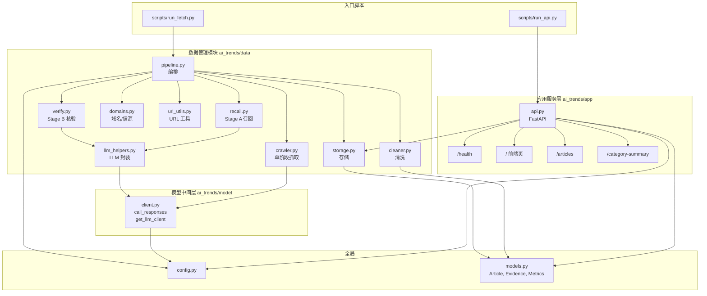
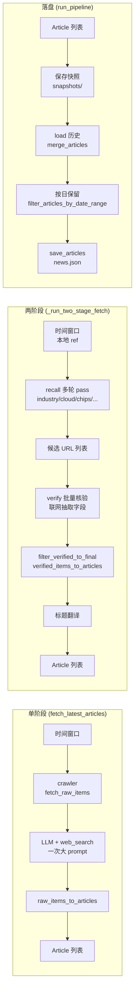
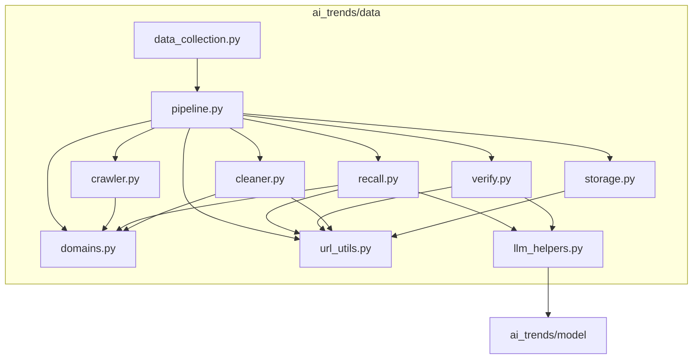

# AI Trends Hub 项目架构图

## 一、整体三层架构

```
┌─────────────────────────────────────────────────────────────────────────────┐
│                           应用服务层 (ai_trends/app)                          │
│  FastAPI：/ 前端页、/health、/articles、/category-summary                      │
│  依赖：config、models、data.load_articles                                      │
└─────────────────────────────────────────────────────────────────────────────┘
                                        │
                                        ▼
┌─────────────────────────────────────────────────────────────────────────────┐
│                         数据管理模块 (ai_trends/data)                          │
│  pipeline 编排 │ crawler / recall+verify │ cleaner │ storage                  │
│  依赖：config、models、model.call_responses / llm_helpers                      │
└─────────────────────────────────────────────────────────────────────────────┘
                                        │
                                        ▼
┌─────────────────────────────────────────────────────────────────────────────┐
│                        模型调用中间层 (ai_trends/model)                        │
│  get_llm_client、call_responses（Responses API / Chat Completions 降级）        │
│  依赖：config                                                                  │
└─────────────────────────────────────────────────────────────────────────────┘
                                        │
                                        ▼
┌─────────────────────────────────────────────────────────────────────────────┐
│                         外部：OpenAI / 国产 LLM API                            │
└─────────────────────────────────────────────────────────────────────────────┘
```

---

## 二、Mermaid 架构图（层级与数据流）



---

## 三、抓取数据流（单阶段 vs 两阶段）



---

## 四、数据管理模块内部依赖



---

## 五、两阶段召回 Pass 一览

| Pass 名称 | 用途 |
|-----------|------|
| reuters-core | 路透 AI/芯片/GPU/HBM/CoWoS |
| cloud-dc | 云厂商 GPU 实例、数据中心 |
| chips-supply | HBM/DRAM/GDDR/CoWoS/ABF 供应与价格 |
| policy-geo | 出口管制、中国许可 |
| china-llm | 国产大模型发布与开源 |
| funding-ma | 融资、并购、投资 |
| **industry-application** | **行业应用与落地（医疗/金融/制造/教育/自动驾驶等）** |
| **research-algorithms** | **科研与算法（论文/顶会/新架构/评测）** |
| channel-aib-system | 渠道/系统商报价与交期（可选） |
| procurement-cost | 采购与成本（可选） |
| memory-cost | 内存与成本（可选） |

---

## 六、模块职责速览

| 模块 | 文件 | 职责 |
|------|------|------|
| 配置 | `config.py` | 路径、时间窗口、两阶段开关、LLM 厂商与 Key、Stage A/B 参数 |
| 数据模型 | `models.py` | Article、Evidence、Metrics 等 Pydantic 模型 |
| 编排 | `data/pipeline.py` | 选择单阶段/两阶段，执行抓取→清洗→快照→合并→落盘 |
| 单阶段抓取 | `data/crawler.py` | 构建 prompt，调用 LLM（web_search），解析 JSON 为 raw_items |
| Stage A 召回 | `data/recall.py` | 多轮 pass 生成检索词，联网召回候选 URL |
| Stage B 核验 | `data/verify.py` | 对候选 URL 批量联网核验，抽取 title/summary/evidence/main_category |
| 清洗 | `data/cleaner.py` | raw→Article、核验结果→Article，segment→main_category，标题翻译 |
| 存储 | `data/storage.py` | load/save JSON、merge 去重、备份、按日期过滤 |
| 域名与信源 | `data/domains.py` | 白名单、行业/科研信源、get_preferred_domains_hint |
| URL 工具 | `data/url_utils.py` | canonicalize、domain_allowed、norm_title 等 |
| LLM 辅助 | `data/llm_helpers.py` | call_model_json_array、JSON 解析与修复 |
| 模型层 | `model/client.py` | get_llm_client、call_responses（Responses/Chat 降级） |
| 应用 | `app/api.py` | FastAPI、前端页、/articles、/category-summary |

---

## 七、配置文件与入口

| 类型 | 路径 | 说明 |
|------|------|------|
| 环境变量示例 | `env.example.sh` | 复制为 `env.sh` 并 `source`，配置 LLM Key/Provider/Model |
| 抓取入口 | `scripts/run_fetch.py` | 调用 `run_pipeline()`，更新 `data/news.json` 与快照 |
| API 入口 | `scripts/run_api.py` | 启动 uvicorn，挂载 `ai_trends.app.api:app` |
| 聚合数据 | `data/news.json` | 合并去重后的新闻列表 |
| 快照 | `data/snapshots/snapshot_*_to_*.json` | 每次抓取的结构化快照 |
